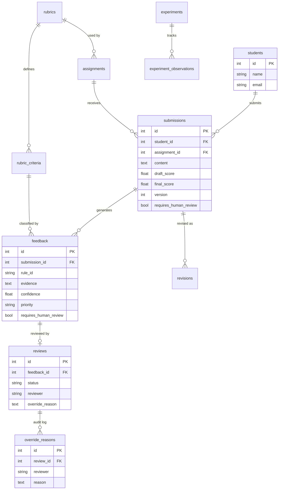

# Formative Feedback Assistant

> Deterministic, explainable formative feedback for online course submissions — with human-in-the-loop mentor oversight for all high-impact decisions and comprehensive experiment and validation tracking.

---

## 1. Project Purpose & Scope

The **Formative Feedback Assistant** is an educational technology system engineered to bridge the formative assessment gap in scaled online courses. When thousands of students submit written work simultaneously, human mentors cannot provide instantaneous, line-by-line formative critique.

Assistant capabilities:
- **Instantaneous Formative Feedback**: Evaluates submissions against structured rubric criteria in under 2 seconds.
- **Non-Fabricated Evidence Extraction**: Directly quotes relevant text passages from student submissions without hallucination.
- **Actionable Recommendations**: Maps detected gaps to pedagogical next steps and plain-English explanations.
- **Explainable Rule Confidence**: Explicitly communicates system rule applicability certainty (distinguished from student performance).
- **Human Oversight for High-Impact Decisions**: Automatically identifies high-impact or low-confidence decisions (extreme scores, plagiarism signals, ambiguous contexts) and routes them to a human mentor review queue.
- **Mentor Workflow (Approve / Modify / Reject)**: Mentors triage flagged recommendations with mandatory documented override justifications stored in an immutable audit trail.
- **Revision History & Quality Tracking**: Measures draft-to-final quality gain across iterative revisions.
- **A/B Experimentation**: Compares the formative assistant against traditional generic delayed feedback baselines.
- **9-Class Error Taxonomy**: Systematically logs and classifies edge cases to direct rule calibration.
- **Representative User Validation**: Audits usability across simulated student and mentor personas, WCAG 2.1 AA accessibility, non-native language fairness, and explainability comprehension.

> **Important Disclosure**: Experimental metrics and validation observations shown in this prototype are based on seeded/demo data and simulated validation records. They demonstrate the evaluation workflow and should not be presented as results from a real-world external participant study. Representative user validation records reflect simulated persona walkthroughs.

---

## 2. Technology Stack

- **Frontend**: React 18, Vite, React Router 6, Recharts, Modern SaaS Dashboard UI/UX
- **Backend**: FastAPI (Python 3.11), Pydantic v2 validation, Starlette
- **Database & ORM**: SQLite, SQLAlchemy 2.0 (14 ORM tables)
- **Testing & Verification**: Pytest, Pytest-Asyncio, Requests/TestClient (79 automated tests)

---

## 3. Current Functionality & Architecture

The application provides two dedicated operational workspaces alongside an evaluation and research suite:

### Learner Workspace
1. **Dashboard (/student)**: Overview of current course progress, active assignments, and detailed criteria weights.
2. **Course Rubric (/student/assignment)**: Deep-dive rubric view detailing criteria weights, minimum conditions, and evaluation standards.
3. **Submit Draft (/student/submission)**: Real-time writing environment with live word count, character count, and draft versioning.
4. **Feedback (/student/feedback)**: Actionable recommendations with excerpted evidence quotes, priority levels, rule certainty meters, and criteria badges.
5. **Revisions & Timeline (/student/revision)**: Side-by-side draft versus revision diff viewer tracking score deltas, version history, and addressed feedback.
6. **Progress Analytics (/student/progress)**: Longitudinal mastery metrics across rubric criteria over time.

### Mentor & Moderation Workspace
1. **Overview (/mentor)**: High-level cohort health KPIs, review queue velocity, and priority alerts.
2. **Review Queue (/mentor/reviews)**: Dedicated human-in-the-loop triage interface. Features full original submission rendering, separate evidence snippets, rule explainability cards, "WHY THIS RULE FIRED" context, mentor verification checklists, and mandatory documented justifications for all override actions (Approve, Modify, Reject).
3. **Cohort Metrics (/mentor/metrics)**: Aggregated cohort performance indicators, submission counts, and rubric coverage.

### Evaluation & Rigor Suite
1. **A/B Experiments (/mentor/experiment)**: Controlled evaluation comparing Control (generic delayed feedback) versus Treatment (assistant workflow) measuring draft-to-final score improvements, rubric coverage, and instructor feedback adherence.
2. **Error Analysis / 9-Class Error Taxonomy (/mentor/errors)**: 9-class error classification taxonomy (False positive, False negative, Incorrect evidence, Incorrect rule, Low-confidence recommendation, Language-related issue, Ambiguous submission, Human override, Ground truth not available) with precision audits and missing ground-truth handling.
3. **Human Validation (/mentor/validation)**: 4-tab interactive validation suite covering:
   - **Simulated Representative User Panel**: Task completion rates and Likert ease/usefulness ratings from simulated student and mentor personas.
   - **WCAG 2.1 AA Accessibility Checklist**: 8-point audit verifying keyboard navigation, visible focus indicators, semantic labels, contrast, and screen-reader compatibility.
   - **Language Diversity & Fairness**: Non-native ESL evaluation verifying grammar feedback is isolated into low-priority informational notes without deducting conceptual points.
   - **Explainability Validation**: Verification of the 7 core explainability questions ensuring complete transparency.
4. **Stress & Robustness (/mentor/stress)**: Stage 2 validation dashboard showing:
   - Synthetic Validation Corpus results (16 cases, 0 failures, 0 evidence fabrication errors)
   - Evidence Extraction Audit (40 tests proving the non-fabrication invariant)
   - Simulated Local Concurrency Benchmark (actual measured latency across 10/25/50/100 concurrent users)
   - API Rate Limit status and test results (slowapi, 30 req/min per IP, HTTP 429 on excess)

---

## 4. Key Core Features & Safeguards

- **Deterministic Rubric-Based Feedback**: Evaluates submissions against multi-criteria rubrics (Definition 20%, Advantages 30%, Real-World Examples 30%, Organization 10%, Clarity 10%).
- **Non-Fabricated Evidence Extraction**: Text quotes are extracted verbatim via substring search; no evidence is ever hallucinated or synthesized. Formally documented in `EVIDENCE_EXTRACTION.md` and verified by `test_evidence.py`.
- **Actionable Recommendations**: Feedback messages provide concrete next steps referencing specific rubric requirements.
- **Rule Confidence Calibration**: Explicitly informs mentors and students that confidence represents pattern match certainty, not the learner's subject mastery.
- **High-Impact Human Review**: Low scores (<20), plagiarism heuristic signals, extreme high scores (>95), and low pattern confidence (<0.50) are held in pending state until reviewed by an authorized human mentor.
- **Mentor Approve / Modify / Reject Workflow**: Mentors can confirm, edit, or dismiss recommendations.
- **Mandatory Override Reason**: Mentors modifying or rejecting automated recommendations must submit a documented justification.
- **Audit Trail**: Every override justification, reviewer name, and timestamp is permanently recorded in an immutable audit log.
- **Revision History**: Comprehensive tracking of draft versus revision progression with score delta computation.
- **Transparent Missing Data & Ground Truth**: The system renders explicit "Insufficient measured data" or "Ground truth not available" notices when empirical labels are missing.
- **API Rate Limiting**: 30 requests/minute per IP enforced via `slowapi`. Returns HTTP 429 on excess. Prototype configuration — not a production capacity claim.

---

## 5. Measured Prototype Experiment Metrics

Calculated directly from the active experiment dataset (`backend/seed.py` and `backend/routers/experiments.py`):

| Evaluation Metric | Baseline (Control, n=5) | Formative Assistant (Treatment, n=7) | Measured Net Gain |
|---|---|---|---|
| **Average Draft Score** | 49.20 / 100 | 45.86 / 100 | -3.34 pts (Comparable initial cohorts) |
| **Average Final Score** | 61.00 / 100 | 77.57 / 100 | **+16.57 pts higher final achievement** |
| **Average Quality Improvement** | **+11.80 pts** | **+31.71 pts** | **+19.91 pts differential gain** |
| **Relative Improvement** | **+24.0%** | **+69.2%** | **+168.7% relative efficacy lead** |
| **Median Improvement** | +12.00 pts | +32.00 pts | +20.00 pts median increase |
| **Final Rubric Coverage** | 62.0% | 89.0% | +27.0% criteria coverage advantage |
| **Instructor Notes Addressed** | 60.0% (3/5) | 85.7% (6/7) | +25.7% follow-through adherence |
| **Recommendation Action Rate** | N/A | 94.1% (16/17 acted upon) | High student follow-through |

*(Note: In exploratory drafts, intermediate subsets were cited as +30.3 pts / +64.1%. The authoritative values calculated dynamically by the active engine for the full 7-student prototype cohort are **+31.71 pts average improvement** and **+69.2% relative gain**).*

---

## 6. Quick Start & Local Execution

### Prerequisites
- Python 3.11+
- Node.js 18+ and npm

### 1. Backend Setup
```bash
cd backend
pip install -r requirements.txt
uvicorn main:app --reload
```
- Backend API runs at: **http://localhost:8000**
- Interactive Swagger API Docs: **http://localhost:8000/docs**
- SQLite database (`formative_feedback.db`) is initialized and seeded automatically on first startup.

### 2. Frontend Setup
```bash
cd frontend
npm install
npm run dev
```
- Frontend application runs at: **http://localhost:5173**

### 3. Run Automated Tests
```bash
cd backend
python -m pytest tests/ -v
```

**Verified Test Suite Status (Stage 2)**:
```
collected 128 items

tests/test_api.py    ..................................... (35 tests)
tests/test_engine.py ........................s        (25 tests, 1 skipped)
tests/test_experiment.py ..............              (14 tests)
tests/test_evidence.py .....................................  (40 tests)
tests/test_rate_limit.py .........                 (9 tests)

==================== 127 passed, 1 skipped, 1 warning in 7.02s ====================
```
- **127 passed, 1 skipped (conditional skip), 0 failed**

### 4. Run Corpus Validation
```bash
python validation/run_corpus.py --verbose
```
- 16 synthetic cases · 16 passed · 0 failed · 0 evidence fabrication errors

### 5. Run Load Benchmark
```bash
# Backend must be running first
python validation/load_test.py --levels 10 25 50 100
```
- Results saved to `validation/load_test_results.json` and displayed in the Stress & Robustness dashboard.

---

## 7. Documentation Index

- [`REQUIREMENTS.md`](./REQUIREMENTS.md): Formal user requirements, functional specifications (FR-1 through FR-8), and non-functional requirements (NFR-1 through NFR-8).
- [`REQUIREMENTS_TRACEABILITY.md`](./REQUIREMENTS_TRACEABILITY.md): 42-requirement matrix verifying implementation, live application evidence, documentation citations, and automated tests.
- [`VALIDATION.md`](./VALIDATION.md): Comprehensive validation report covering baseline conditions, prototype results, 9-type error taxonomy, accessibility, language fairness, and simulated user panels.
- [`ARCHITECTURE.md`](./ARCHITECTURE.md): Component diagrams, data models, rule execution order, and human-in-the-loop lifecycle.
- [`LIMITATIONS.md`](./LIMITATIONS.md): Candid academic and operational limitations including seed/demo data constraints, regex keyword matching boundaries, and human review requirements.
- [`EVIDENCE_EXTRACTION.md`](./EVIDENCE_EXTRACTION.md): **[Stage 2]** Complete audit and methodology documentation of evidence extraction — proves non-fabrication invariant, documents known computed-evidence rules (RULE_LANG_001, RULE_PLAG_001), and covers all engine pattern-matching mechanisms.
- [`LOAD_TESTING.md`](./LOAD_TESTING.md): **[Stage 2]** Concurrency benchmark methodology, actual measured results, limitations, and how to re-run the benchmark.

---

## 8. Unit Testing Reference

### Test Suite Structure

The backend test suite lives in `backend/tests/`. Run it from the `backend/` directory:

```bash
cd backend
python -m pytest tests/ -v
```

**Verified result (Stage 2):** `127 passed, 1 skipped, 0 failed, 1 warning`

The single skipped test (`TestMissingEvidence::test_org_rule_evidence_when_rule_fires`) is a **conditional skip** — `RULE_ORG_001` does not fire on the short test text supplied, so there is no evidence to assert against. The skip is intentional and documents a known engine threshold, not a bug.

---

### Test Files

#### `tests/test_engine.py` — Unit tests for the feedback engine (pure functions)

**Type:** True unit tests. No database, no HTTP, no external dependencies.  
**Tests:** 24 tests, 1 skipped  

Tests the deterministic rule engine directly by calling `analyze_submission()` and inspecting `EngineOutput`:

| Test class | What it covers |
|---|---|
| `TestVeryShortSubmission` | RULE_CLR_001 fires, low score, human-review flag on < 10 words |
| `TestWellWrittenSubmission` | High-quality text scores high, no false positives |
| `TestDefinitionOnly` | Definition text → RULE_ADV_001 fires, RULE_EX_001 fires |
| `TestMixedContent` | Multiple rules fire simultaneously |
| `TestEdgeCaseEmptyText` | `ValueError` on empty or whitespace-only text |
| `TestLanguageRobustness` | Non-native grammar style does not reduce conceptual score |
| `TestNonFabricatedEvidence` | All evidence fields are `""` or verbatim substrings of input |
| `TestHighImpactTriggers` | RULE_HI_001 (score < 20) and RULE_HI_002 (score ≥ 93) |

---

#### `tests/test_api.py` — Integration tests for all FastAPI endpoints

**Type:** Integration tests using `starlette.testclient.TestClient` with an in-memory SQLite database (from `conftest.py`).  
**Tests:** 35 tests  

Tests that the full request–response cycle works correctly including input validation, 404 handling, and response schema conformance:

| Test class / area | Key assertions |
|---|---|
| Submission creation | 201 Created, blank content → 422 Unprocessable Entity |
| Feedback generation | Score returned, feedback list non-empty, rule IDs correct |
| Revisions | Version increments, score updated, `final_score` propagated |
| Reviews | Pending → Approved/Rejected/Modified; 400 on re-action of resolved review |
| Override reason | 422 when `override_reason` missing for `rejected`/`modified` |
| Explainability fields | `high_impact_reason`, `submission_content`, `confidence` present in review response |
| Metrics | `/api/metrics` returns counts and averages without errors |

---

#### `tests/test_experiment.py` — Integration tests for experiment calculations

**Type:** Integration tests (TestClient + in-memory DB).  
**Tests:** 14 tests  

Covers the A/B comparison endpoint and related validation endpoints:

| Test area | Coverage |
|---|---|
| Group stats | Average improvement, median, rubric coverage per group |
| Missing data handling | Returns `None` gracefully when groups have no observations |
| Relative improvement | Formula: `(final − draft) / draft × 100` |
| Instructor feedback adherence | Boolean addressed flag per observation |
| Error analysis CRUD | POST new record → GET summary with correct counts |
| User validation | POST rating record → GET summary aggregates |
| WCAG accessibility checklist | GET 8 items; POST status update persists |
| Language validation | GET language case results |
| Explainability checks | GET 7 questions; POST status update persists |

---

#### `tests/test_evidence.py` — Evidence extraction invariant tests (Stage 2)

**Type:** Unit tests (direct engine calls, no HTTP).  
**Tests:** 40 tests, 1 skipped  

Formally verifies the **non-fabrication golden invariant**:

> For every feedback item: `evidence == ""` OR `core_of_evidence` is a substring of the original submission text.

The "core" strips leading/trailing `…` ellipsis characters added by `_find_snippet()`.

| Test class | Coverage |
|---|---|
| `TestExactEvidenceExtraction` | Evidence substring present for rules that should fire |
| `TestNoEvidenceWhenRuleDoesNotFire` | Evidence is `""` when no pattern matches |
| `TestAmbiguousEvidence` | RULE_EX_003 evidence derivable from text |
| `TestEllipsisSnippets` | Stripping ellipsis → still a substring of original |
| `TestEmptySubmission` | `ValueError` raised, not a fabricated evidence |
| `TestVeryShortSubmission` | Evidence `""` or verbatim match |
| `TestMustNotFabricate` (parametrized) | 7 rule functions tested against submissions where they must not fire |
| `TestMultipleRulesFiring` | Multiple rules fire simultaneously; all evidence valid |
| `TestMissingEvidence` | Evidence absent when criteria not met |

**Known computed-evidence rules** (exempted from verbatim-substring check):
- `RULE_LANG_001` — returns diagnostic string (e.g. `"Multiple consecutive spaces detected."`)
- `RULE_PLAG_001` — returns computed diagnostic (e.g. `"Long unbroken sentence detected (52 words): '...'"`

These are documented limitations, not fabrication. See [`EVIDENCE_EXTRACTION.md`](./EVIDENCE_EXTRACTION.md).

---

#### `tests/test_rate_limit.py` — API rate limit enforcement tests (Stage 2)

**Type:** Integration tests (TestClient).  
**Tests:** 9 tests  

Verifies the `slowapi` rate-limiting middleware:

| Test | What it checks |
|---|---|
| `test_within_limit_succeeds` | First 10 requests → 200 OK |
| `test_rate_limit_triggers_429` | 31st request → 429 Too Many Requests |
| `test_429_response_body_is_json` | Response body is valid JSON |
| `test_429_retry_after_header` | `Retry-After` header present |
| `test_health_endpoint_not_rate_limited` | `/health` returns 200 regardless of limit state |
| `test_limiter_resets_between_test_functions` | Limiter state isolated between test functions |
| `test_rate_limit_config_is_correct` | ~30 successes then 429 within 35 rapid requests to `/api/students` |
| `test_second_burst_also_triggers_429` | Second burst after reset also triggers 429 |
| `test_burst_triggers_429` | Burst of 35 → 429 before end of burst |

**Implementation note:** Each test function uses an `autouse` fixture that calls `limiter.reset()` before and after the test to prevent state leakage.

---

#### `validation/run_corpus.py` — Synthetic corpus validation (not pytest)

**Type:** Standalone Python script (not part of the pytest suite).  
**Run:** `python validation/run_corpus.py --verbose`  
**Result:** 16/16 PASS, 0 evidence fabrication errors  

Tests 16 hand-crafted synthetic student submissions against the engine and checks:
- Score within expected range
- Human-review flag matches expectation
- Expected rule IDs fire
- Priority matches
- No fabricated evidence (invariant check)

See [`validation/corpus.py`](./validation/corpus.py) for case definitions.

---

## 9. Error Handling & Error Boundaries

### Frontend Error Boundary (React)

**File:** `frontend/src/components/ErrorBoundary.jsx`  
**Wraps:** All page routes in `App.jsx` via `<ErrorBoundary><Routes>...</Routes></ErrorBoundary>`

React requires a **class component** to catch render-time errors. `ErrorBoundary` uses `getDerivedStateFromError` (to set error state) and `componentDidCatch` (to log the error).

**What it catches:**
- Unhandled JavaScript exceptions thrown during the render phase of any page component
- Exceptions in `componentDidMount` / `componentDidUpdate` of class children

**What it does NOT catch (React limitation):**
- Async errors inside event handlers (e.g. `onClick` callbacks) — these throw asynchronously outside React's render lifecycle
- Errors in async `useEffect` callbacks that reject after render completes — these are handled per-page
- Errors in the `ErrorBoundary` component itself

**User experience when triggered:**
- Instead of a blank white screen the user sees a card with a brief error message and a **"Try again"** button
- The "Try again" button calls `setState({ hasError: false })` which re-renders the children
- The sidebar and top header remain visible — only the main content area is replaced by the fallback

**Normal application behavior:**
- When no error is thrown `ErrorBoundary` renders its `children` unchanged — zero performance impact

---

### Per-Page API Error Handling (React)

Each page component follows this pattern:

```js
const [error, setError] = useState(null)

useEffect(() => {
  fetchData()
    .then(data => setState(data))
    .catch(err => setError(err.message))   // captured here, not by ErrorBoundary
    .finally(() => setLoading(false))
}, [])

if (error) return <div className="error-state">Failed to load: {error}</div>
```

This means **API/network errors are displayed inline within the page** (not caught by the boundary). The `axios` client in `frontend/src/api/client.js` has a 15-second timeout; requests that exceed this return an `ECONNABORTED` error which pages surface as inline error states.

---

### Backend Error Handling (FastAPI)

FastAPI provides structured error handling at multiple layers:

| Layer | Mechanism | HTTP status |
|---|---|---|
| Pydantic request validation | `RequestValidationError` → automatic 422 response with field-level detail | 422 |
| Missing required field | Pydantic `Field(min_length=1)` validator | 422 |
| Blank submission content | `@field_validator("content")` in `SubmissionCreate` | 422 |
| Missing override reason | `@model_validator` in `ReviewAction` | 422 |
| Resource not found | `raise HTTPException(status_code=404)` in routers | 404 |
| Already-actioned review | `raise HTTPException(status_code=400)` when `review.status != "pending"` | 400 |
| Rate limit exceeded | `SlowAPIMiddleware` → `_rate_limit_exceeded_handler` | 429 |
| Engine `ValueError` (empty text) | Propagates to FastAPI as HTTP 500 (unhandled runtime exception) |
| SQLAlchemy DB errors | Not explicitly caught — propagate as HTTP 500 |

**422 Unprocessable Entity response format** (standard FastAPI):
```json
{
  "detail": [
    {
      "loc": ["body", "content"],
      "msg": "Submission content cannot be blank or whitespace only.",
      "type": "value_error"
    }
  ]
}
```

**429 Too Many Requests response format** (slowapi):
```json
{
  "error": "Rate limit exceeded: 30 per 1 minute"
}
```

**Known limitation:** If `analyze_submission()` raises `ValueError` due to an empty text that passes Pydantic validation (edge case), FastAPI returns a generic HTTP 500. This is a documented known limitation — the fix is to add a try/except in the router and return 422. This edge case is not reachable via normal frontend usage.

---

## 10. API Reference

Base URL: `http://localhost:8000/api`  
Interactive docs: `http://localhost:8000/docs` (Swagger UI)  
Authentication: None — prototype uses persona dropdown selection in the frontend.  
Rate limit: 30 requests/minute per client IP (HTTP 429 on excess). `/health` is exempt.

---

### Submissions & Students

#### `GET /api/students`
Returns all registered students.  
**Response:** `[{ id, name, email }]`  
**Status:** 200

#### `GET /api/assignments`
Returns all assignments with embedded rubric and criteria details.  
**Response:** `[{ id, title, description, rubric_id, rubric: { id, name, criteria: [...] } }]`  
**Status:** 200

#### `GET /api/rubrics/{rubric_id}`
Returns a single rubric with its criteria.  
**Path param:** `rubric_id` — integer  
**Response:** `{ id, name, description, criteria: [{ id, criterion_id, name, weight, min_conditions, rules }] }`  
**Status:** 200 / 404

#### `POST /api/submissions`
Creates a new draft submission. Auto-scores via the feedback engine.  
**Request body:**
```json
{ "student_id": 1, "assignment_id": 1, "content": "Essay text…", "is_final": false }
```
**Validation:** `content` must be non-blank (422 if blank or whitespace-only).  
**Response:** `{ id, student_id, assignment_id, content, version, draft_score, final_score, submitted_at, is_final }`  
**Status:** 201 / 404 (student or assignment not found) / 422 (validation error)

#### `GET /api/submissions/{student_id}`
Returns all submissions for a given student, ordered by `submitted_at`.  
**Status:** 200 / 404

---

### Feedback

#### `POST /api/feedback`
Runs the deterministic feedback engine on a previously created submission. Replaces any existing feedback for that submission (idempotent re-run). If the engine determines human review is required, creates a `Review` record with `status="pending"`.  
**Request body:** `{ "submission_id": 1 }`  
**Response:**
```json
{
  "submission_id": 1,
  "score": 58.4,
  "requires_human_review": true,
  "high_impact_reason": "Extremely short submission…",
  "feedback": [
    {
      "id": 1, "rule_id": "RULE_DEF_001", "criterion_key": "DEF",
      "message": "…", "evidence": "…quoted text…",
      "confidence": 0.85, "priority": "high",
      "requires_human_review": false, "generated_at": "…"
    }
  ]
}
```
**Status:** 200 / 404

#### `GET /api/feedback/{submission_id}`
Returns all stored feedback items for a submission.  
**Response:** `[FeedbackItemOut]`  
**Status:** 200 / 404

---

### Revisions

#### `POST /api/revisions`
Submits a revised draft. Auto-scores via engine. Updates `original_submission.final_score` and marks it `is_final=True`.  
**Request body:** `{ "original_submission_id": 1, "content": "Revised text…" }`  
**Validation:** `content` must be non-blank.  
**Response:** `{ id, original_submission_id, content, version, score, submitted_at }`  
**Status:** 201 / 404

#### `GET /api/revisions/{submission_id}`
Returns all revisions for a submission, ordered by version.  
**Status:** 200 / 404

---

### Mentor Reviews (Human-in-the-Loop)

#### `GET /api/reviews`
Returns all review records. Optionally filtered by status.  
**Query param:** `?status=pending` (optional; values: `pending`, `approved`, `rejected`, `modified`)  
**Response includes denormalized fields:** `student_name`, `assignment_title`, `criterion_name`, `evidence`, `submission_content`, `submission_score`, `high_impact_reason`, `confidence`, `priority`, `rule_id`  
**Status:** 200

#### `POST /api/reviews/{review_id}`
Mentor takes action on a pending review. Creates an immutable `OverrideReason` audit record if status is `rejected` or `modified`.  
**Path param:** `review_id` — integer  
**Request body:**
```json
{
  "status": "approved",
  "reviewer": "Dr. Priya",
  "override_reason": null,
  "final_decision": null
}
```
**Validation:**
- `status` must be one of `approved`, `rejected`, `modified` (422 otherwise)
- `override_reason` is required when `status` is `rejected` or `modified` (422 if missing)
- Review must be in `pending` state — attempting to re-action returns 400

**Status:** 200 / 400 (already actioned) / 404 / 422 (validation)

---

### Cohort Metrics

#### `GET /api/metrics`
Returns cohort-level aggregate metrics computed from the current database state.  
**Response includes:** submission counts, review status counts, score averages, rubric coverage %, mentor workload, per-criterion improvement, `data_label` disclaimer string.  
**Note:** `feedback_accuracy` and `feedback_usefulness` are `null` — no validated production data.  
**Status:** 200

---

### Experiments & Validation

#### `GET /api/experiments/comparison`
Returns A/B experiment group statistics (BASELINE vs PROTOTYPE).  
**Response:** `{ experiment, baseline_stats, prototype_stats, net_gain, relative_gain_pct, … }`

#### `GET /api/experiments/observations`
Returns individual experiment observations.  
**Query param:** `?group=BASELINE` or `?group=PROTOTYPE` (optional)

#### `GET /api/experiments/instructor-feedback`
Returns per-observation instructor feedback adherence data.

#### `GET /api/experiments/error-analysis`
Returns the 9-class error taxonomy summary and individual records.

#### `POST /api/experiments/error-analysis`
Creates a new error analysis record.  
**Request body:** `{ student_name, recommendation, expected_result, actual_result, error_type, impact, correction_improvement, ground_truth_available, is_correct }`

#### `GET /api/experiments/validation/user`
Returns user validation summary (simulated persona panel).

#### `POST /api/experiments/validation/user`
Adds a user validation record.

#### `GET /api/experiments/validation/accessibility`
Returns the 8-point WCAG 2.1 AA accessibility checklist.

#### `POST /api/experiments/validation/accessibility/{check_id}`
Updates an accessibility check status (`Pass`/`Fail`/`Needs Improvement`).

#### `GET /api/experiments/validation/language`
Returns language diversity / ESL validation results.

#### `GET /api/experiments/validation/explainability`
Returns the 7-question explainability validation checklist.

#### `POST /api/experiments/validation/explainability/{check_id}`
Updates an explainability check status (`UNDERSTOOD`/`NOT UNDERSTOOD`).

---

### System

#### `GET /`
Returns application name, version, and docs URL.

#### `GET /health`
Returns `{ "status": "ok" }`. Exempt from rate limiting. Used for uptime monitoring and benchmark probes.

---

## 11. Database Schema

**Database:** SQLite (`backend/formative_feedback.db`)  
**ORM:** SQLAlchemy 2.0 (`backend/models.py`)  
**Tables:** 13 tables across domain, experiment, and validation layers.

---

### Core Domain Tables

#### `students`
| Column | Type | Notes |
|---|---|---|
| `id` | Integer PK | Auto-increment |
| `name` | String(120) | NOT NULL |
| `email` | String(200) | Unique, NOT NULL |

**Relationships:** 1→M to `submissions`

---

#### `rubrics`
| Column | Type | Notes |
|---|---|---|
| `id` | Integer PK | |
| `name` | String(200) | NOT NULL |
| `description` | Text | Nullable |

**Relationships:** 1→M to `rubric_criteria`; 1→M to `assignments`

---

#### `rubric_criteria`
| Column | Type | Notes |
|---|---|---|
| `id` | Integer PK | |
| `rubric_id` | Integer FK → `rubrics.id` | NOT NULL |
| `criterion_id` | String(50) | Unique; e.g. `"DEF"`, `"ADV"`, `"EX"`, `"ORG"`, `"CLR"` |
| `name` | String(200) | NOT NULL |
| `weight` | Float | 0.0–1.0; weights across all criteria sum to 1.0 |
| `min_conditions` | Text | JSON-encoded list of condition dicts |
| `rules` | Text | JSON-encoded list of rule dicts |

**Relationships:** M→1 to `rubrics`; 1→M to `feedback`

---

#### `assignments`
| Column | Type | Notes |
|---|---|---|
| `id` | Integer PK | |
| `title` | String(300) | NOT NULL |
| `rubric_id` | Integer FK → `rubrics.id` | NOT NULL |

**Relationships:** M→1 to `rubrics`; 1→M to `submissions`

---

#### `submissions`
| Column | Type | Notes |
|---|---|---|
| `id` | Integer PK | |
| `student_id` | Integer FK → `students.id` | NOT NULL |
| `assignment_id` | Integer FK → `assignments.id` | NOT NULL |
| `content` | Text | The full submission text; NOT NULL |
| `submitted_at` | DateTime | UTC |
| `is_final` | Boolean | Set True when a revision is submitted |
| `version` | Integer | 1 = draft; increments with each new submission |
| `draft_score` | Float | 0–100; set by engine on creation; nullable |
| `final_score` | Float | 0–100; set when revision submitted; nullable |

**Relationships:** M→1 to `students`, `assignments`; 1→M to `feedback`, `revisions`

---

#### `feedback`
| Column | Type | Notes |
|---|---|---|
| `id` | Integer PK | |
| `submission_id` | Integer FK → `submissions.id` | NOT NULL |
| `criterion_id` | Integer FK → `rubric_criteria.id` | Nullable |
| `message` | Text | Human-readable feedback message; NOT NULL |
| `evidence` | Text | Exact substring quote from submission, or `""` |
| `rule_id` | String(50) | e.g. `"RULE_DEF_001"`; NOT NULL |
| `confidence` | Float | 0.0–1.0 |
| `priority` | String(20) | `"high"` / `"medium"` / `"low"` |
| `requires_human_review` | Boolean | True → triggers a Review record |
| `high_impact_reason` | Text | Explanation of why human review was triggered |
| `generated_at` | DateTime | UTC |

**Relationships:** M→1 to `submissions`, `rubric_criteria`; 1→1 to `reviews`

---

#### `revisions`
| Column | Type | Notes |
|---|---|---|
| `id` | Integer PK | |
| `original_submission_id` | Integer FK → `submissions.id` | NOT NULL |
| `content` | Text | Full revised text; NOT NULL |
| `version` | Integer | Starts at 2 (draft = 1) |
| `score` | Float | Engine score at time of submission |
| `submitted_at` | DateTime | UTC |

---

#### `reviews`
| Column | Type | Notes |
|---|---|---|
| `id` | Integer PK | |
| `feedback_id` | Integer FK → `feedback.id` | NOT NULL |
| `status` | String(20) | `"pending"` / `"approved"` / `"rejected"` / `"modified"` |
| `reviewer` | String(120) | Mentor name; nullable until actioned |
| `reviewed_at` | DateTime | Nullable until actioned |
| `override_reason` | Text | Required for rejected/modified |
| `original_recommendation` | Text | Snapshot of feedback message at review creation |
| `final_decision` | Text | Final mentor decision text |

**Relationships:** M→1 to `feedback`

---

#### `override_reasons`
Immutable audit log. One record per `rejected`/`modified` review action.

| Column | Type | Notes |
|---|---|---|
| `id` | Integer PK | |
| `review_id` | Integer FK → `reviews.id` | NOT NULL |
| `reviewer` | String(120) | NOT NULL |
| `reason` | Text | NOT NULL |
| `created_at` | DateTime | UTC |

---

### Experiment & Validation Tables

#### `experiments`
Stores experiment metadata (name, baseline definition, status, date range).

#### `experiment_observations`
One row per student per group. Stores `draft_score`, `final_score`, `improvement_points`, `relative_improvement`, `rubric_coverage_draft`, `rubric_coverage_final`, `instructor_feedback_addressed`, `recommendations_generated`, `recommendations_acted_upon`.

#### `error_analysis_records`
9-class error taxonomy entries — one record per identified engine error or edge case.  
Fields: `student_name`, `recommendation`, `expected_result`, `actual_result`, `error_type`, `impact`, `correction_improvement`, `ground_truth_available`, `is_correct`.

#### `user_validation_records`
Simulated persona validation records. Fields: `role`, `task_ratings` (JSON), `overall_usefulness_rating` (1–5).

#### `accessibility_check_records`
WCAG 2.1 AA checklist items. Fields: `item_name`, `status` (Pass/Fail/Needs Improvement), `comments`, `tester`.

#### `explainability_validation_records`
7-question explainability audit. Fields: `question`, `status` (UNDERSTOOD/NOT UNDERSTOOD), `tester_role`.

---

### Entity Relationship Diagram


